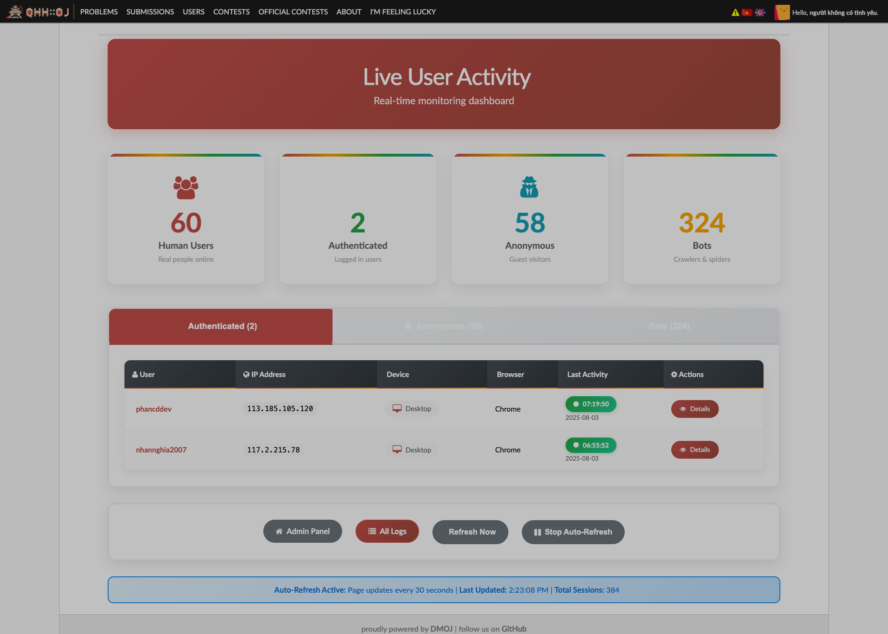
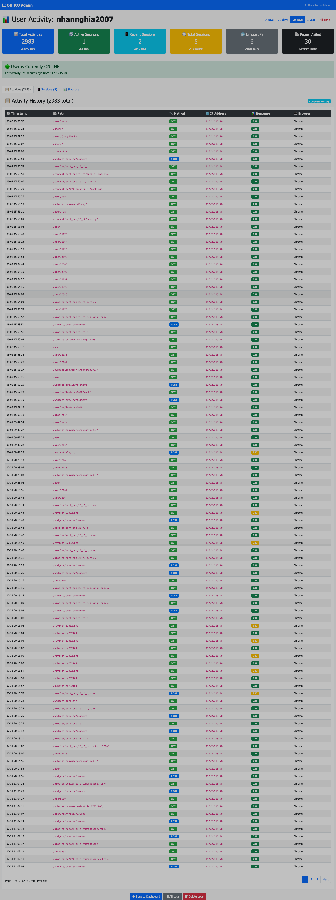

# DMOJ User Activity Tracker

A comprehensive Django app for tracking user activities and sessions in DMOJ online judge system.

## Author

**Phan Cong Dung** ([@phancddev](https://github.com/phancddev))

## Features

- 📊 **Real-time User Tracking**: Monitor active users and their activities in real-time
- 🔍 **Session Management**: Track user sessions with device detection and IP monitoring
- 📱 **Device Detection**: Automatically detect mobile, tablet, desktop, and bot users
- 📈 **Activity Analytics**: Detailed statistics and analytics for user behavior
- 🌐 **IP Tracking**: Monitor user IP addresses and geographic information
- 🛡️ **Admin Interface**: Complete admin interface for monitoring and management
- 📋 **Activity Logs**: Comprehensive logging of user requests and responses
- 🚨 **Anonymous User Tracking**: Track anonymous users alongside authenticated users

## Screenshots

### Active Users Dashboard


### User Activity Detail


The system provides:
- Active users dashboard with real-time updates
- Detailed user activity pages with session history
- Statistics and analytics views
- Admin interface for user management

## Installation

### Prerequisites

- Django 3.2 or higher
- Python 3.8 or higher
- DMOJ online judge system

### Step 1: Install Dependencies

```bash
pip install -r requirements.txt
```

### Step 2: Copy Files

Copy the `user_activity` app to your DMOJ project directory:

```bash
cp -r user_activity /path/to/your/dmoj/project/
cp -r templates/* /path/to/your/dmoj/templates/
```

### Step 3: Update Django Settings

Add the app to your `INSTALLED_APPS` in `settings.py`:

```python
INSTALLED_APPS = [
    # ... existing apps ...
    'user_activity',
]
```

Add the middleware to `MIDDLEWARE` in `settings.py`:

```python
MIDDLEWARE = [
    # ... existing middleware ...
    'user_activity.middleware.UserActivityMiddleware',
]
```

### Step 4: Update URLs

Add the URLs to your main `urls.py`:

```python
from django.urls import path, include

urlpatterns = [
    # ... existing patterns ...
    path('admin/user-activity/', include('user_activity.urls')),
]
```

### Step 5: Database Migration

Create and run migrations:

```bash
python manage.py makemigrations user_activity
python manage.py migrate
```

### Step 6: Update Admin (Optional)

If you want the models to appear in Django admin, add to your main admin config:

```python
# In your main admin/__init__.py or admin.py
from user_activity.admin import UserActivityAdmin, UserSessionAdmin
from user_activity.models import UserActivity, UserSession

admin.site.register(UserActivity, UserActivityAdmin)
admin.site.register(UserSession, UserSessionAdmin)
```

### Step 7: Permissions

Create permission for viewing user activity (optional):

```python
# In your Django shell or create a management command
from django.contrib.auth.models import Permission
from django.contrib.contenttypes.models import ContentType
from user_activity.models import UserActivity

content_type = ContentType.objects.get_for_model(UserActivity)
permission = Permission.objects.create(
    codename='can_see_user_activity',
    name='Can see user activity',
    content_type=content_type,
)
```

## Configuration

### Excluded Paths

You can configure paths to exclude from tracking by modifying the `EXCLUDED_PATHS` in the middleware:

```python
# In user_activity/middleware.py
EXCLUDED_PATHS = [
    r'^/admin/user-activity/active-users/$',
    r'^/static/',
    r'^/media/',
    r'^/favicon\.ico$',
    r'^/robots\.txt$',
    r'^/__debug__/',
    # Add your custom excluded paths here
]
```

### Session Timeout

Configure session timeout for determining active users:

```python
# In your settings.py
SESSION_COOKIE_AGE = 1800  # 30 minutes
```

## Usage

### Accessing the Dashboard

- **Active Users Dashboard**: `/admin/user-activity/active-users/`
- **All Activity Logs**: `/admin/user-activity/all-logs/`
- **User Detail**: `/admin/user-activity/user/{username}/`

### API Endpoints

- **Active Users API**: `/admin/user-activity/api/active-users/`
- **User Stats API**: `/admin/user-activity/api/user-stats/{username}/`

### Permissions

To access the user activity views, users need the `judge.can_see_user_activity` permission.

## Models

### UserSession

Tracks user sessions with the following fields:

- `user`: Foreign key to User model (nullable for anonymous users)
- `session_key`: Django session key
- `ip_address`: User's IP address
- `user_agent`: Full user agent string
- `device_type`: Device type (mobile, tablet, desktop, bot, unknown)
- `browser`: Browser name
- `os`: Operating system
- `created_at`: Session creation time
- `last_activity`: Last activity timestamp
- `is_active`: Whether session is currently active

### UserActivity

Tracks individual user activities:

- `user`: Foreign key to User model (nullable for anonymous users)
- `session`: Foreign key to UserSession
- `timestamp`: Activity timestamp
- `path`: Request path
- `method`: HTTP method
- `ip_address`: IP address
- `user_agent`: User agent string
- `referer`: HTTP referer
- `response_code`: HTTP response code

## Management Commands

### Clean Old Activities

Create a management command to clean old activities:

```python
# management/commands/clean_old_activities.py
from django.core.management.base import BaseCommand
from django.utils import timezone
from datetime import timedelta
from user_activity.models import UserActivity

class Command(BaseCommand):
    help = 'Clean old user activities'

    def add_arguments(self, parser):
        parser.add_argument(
            '--days',
            type=int,
            default=90,
            help='Delete activities older than this many days',
        )

    def handle(self, *args, **options):
        cutoff_date = timezone.now() - timedelta(days=options['days'])
        deleted_count = UserActivity.objects.filter(
            timestamp__lt=cutoff_date
        ).delete()[0]
        
        self.stdout.write(
            self.style.SUCCESS(
                f'Successfully deleted {deleted_count} old activities'
            )
        )
```

## Security Considerations

1. **IP Address Privacy**: The system tracks IP addresses. Ensure compliance with privacy regulations in your jurisdiction.

2. **Data Retention**: Implement a data retention policy to automatically clean old activity logs.

3. **Access Control**: Restrict access to user activity views to authorized staff only.

4. **Performance**: Monitor database performance as activity logs can grow large over time.

## Troubleshooting

### High Database Usage

If you experience high database usage:

1. Add database indexes for frequently queried fields
2. Implement data archiving for old activities
3. Consider using database partitioning

### Template Errors

If you encounter template syntax errors:

1. Ensure templates are copied to the correct location
2. Check that template loaders are configured correctly
3. Verify that the app is in `INSTALLED_APPS`

### Middleware Issues

If the middleware doesn't work:

1. Check middleware order in settings
2. Ensure the app is installed correctly
3. Verify database migrations are applied

## Contributing

1. Fork the repository
2. Create a feature branch
3. Make your changes
4. Add tests
5. Submit a pull request

## License

This project is licensed under the MIT License - see the LICENSE file for details.

## Support

For support and questions:

- Create an issue on GitHub
- Contact the author: [@phancddev](https://github.com/phancddev)

## Changelog

### Version 1.0.0
- Initial release
- User activity tracking
- Session management
- Admin interface
- Real-time monitoring
- Device detection # dmoj-user-activity-tracker
